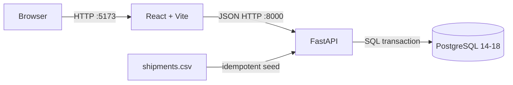
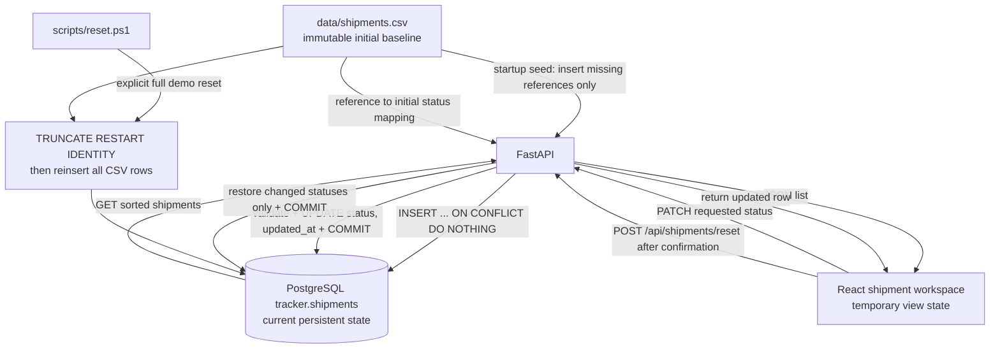

# Delivery Status Tracker 开发与交付计划

> 状态：Step 0–5 已实现；Step 6 代码质量与窄屏闸门已通过；README 已更新，最终冷启动排练和提交打包尚未完成。
>
> 依据：候选人 brief、招聘邮件和随附的 `shipments.csv`。
>
> 目标：在 3-4 小时时间盒内交付一个可从空数据库启动、可操作、可测试、可现场演示的完整纵向切片。
>
> 执行约束：[DEVELOPMENT_RULES.md](DEVELOPMENT_RULES.md)；实际问题、决策和验证证据：[PROJECT_LOG.md](PROJECT_LOG.md)。

## 1. 标记规则

本文用以下标记区分原文要求与自主设计，后续开发和 README 也应沿用这些边界：

- `[REQ-MUST]`：brief 或邮件明确要求，缺少即不合格。
- `[REQ-SHOULD]`：brief 明确表达偏好，但不是绝对硬性条件。
- `[REQ-STRETCH]`：brief 明确列为可选增强，只能在 MVP 稳定后做。
- `[DECISION]`：题目允许自由选择，本项目主动确定的方案。
- `[ASSUMPTION]`：原文存在空白或歧义，本项目采用且必须在 README 说明的解释。
- `[OUT]`：明确不在本次范围内，防止时间盒失控。

## 2. 原文要求逐条核对

### 2.1 硬性要求

| 编号 | 类型 | 原文要求的含义 | 本项目的落实方式 | 验收证据 |
| --- | --- | --- | --- | --- |
| R1 | `[REQ-MUST]` | 使用 PostgreSQL 设计 shipment 数据结构 | Alembic migration 创建 `shipments` 表、约束和索引 | migration 可在空库执行；可用 `psql` 查看结构 |
| R2 | `[REQ-MUST]` | 把提供的 CSV 数据载入数据库，载入方式自选 | 启动时执行幂等 seed，读取真实 `data/shipments.csv` | 首次启动恰好 20 条；重启仍是 20 条 |
| R3 | `[REQ-MUST]` | 后端语言和框架是 Python/FastAPI | Python 3.11–3.14 + FastAPI | `/docs` 可访问，API 测试通过 |
| R4 | `[REQ-MUST]` | 提供列出 shipment 及当前状态的接口 | `GET /api/shipments` | 返回 20 条、顺序稳定、字段正确 |
| R5 | `[REQ-MUST]` | 提供更新 shipment 状态的接口 | `PATCH /api/shipments/{reference}/status` | 合法状态更新后返回并持久化新值 |
| R6 | `[REQ-MUST]` | 按生命周期拒绝非法状态转换，并给出清楚错误 | 单一领域规则函数 + HTTP `409` 结构化错误 | 跳级、倒退、终态变更测试通过 |
| R7 | `[REQ-MUST]` | 使用 React 提供 shipment 列表页 | React + TypeScript + Vite 的工作台式表格页 | 浏览器可查看全部 shipment 和状态 |
| R8 | `[REQ-MUST]` | 用户可在网页更新状态 | 每行只显示服务端允许的下一状态和更新操作 | 点击后发出 PATCH 请求 |
| R9 | `[REQ-MUST]` | 更新结果无需整页刷新即可看到 | 用 API 返回值替换对应行的本地状态 | DevTools 中只有 fetch/PATCH，无 document navigation |
| R10 | `[REQ-MUST]` | 至少两个有意义的测试 | 状态转换单元测试 + API 集成测试，目标多于最低线 | `pytest -q` 全部通过 |
| R11 | `[REQ-MUST]` | 数据库、API、UI 有清楚且准确的启动命令，CSV 已可操作 | Windows PowerShell 脚本编排 PostgreSQL 服务、API 和 Web | 从重置数据库到页面可用的验收记录；录屏只用于可选排练/备用 |
| R12 | `[REQ-MUST]` | 提交 Git 仓库链接或 zip，包含完整源代码 | 提交完整仓库，不提交 secrets、本机数据库数据或构建产物 | 新目录按 README 可复现 |
| R13 | `[REQ-MUST]` | README 写精确运行命令和关键决策，包括工具选择理由 | 面向评审的英文 README | README 逐项复核 |
| R14 | `[REQ-MUST]` | README 写 “What I would do next” | 明确列出时间盒后未做事项、原因和优先级 | README 对应章节存在且诚实 |
| R15 | `[REQ-MUST]` | 写 AI 使用说明：工具、生成与手写边界、至少一个 AI 错误及发现方式 | README 中保留真实开发记录，不能虚构错误 | 说明包含具体错误、证据、修复和验证 |
| R16 | `[REQ-MUST]` | 控制在 3-4 小时，时间到停止并记录后续计划 | 开发日志记录开始/停止时间；3 小时后冻结功能范围 | README 披露实际投入和未完成项 |
| R17 | `[REQ-MUST]` | 跳过认证、部署及未列出的产品功能 | 不做登录、权限、云部署、地图、通知或完整 CRUD | 范围复核无无关功能 |

### 2.2 原文明示的偏好与可选项

| 编号 | 类型 | 内容 | 决策 |
| --- | --- | --- | --- |
| P1 | `[REQ-SHOULD]` | 单命令启动是理想状态 | 把 `./scripts/dev.ps1` 提升为本项目 MVP 内部验收条件 |
| P2 | `[REQ-SHOULD]` | 建议一个转换规则测试和一个 API 测试 | 两类都做，并额外覆盖非法更新后数据库值不变 |
| S1 | `[REQ-STRETCH]` | 按状态筛选 shipment | MVP 完成后第一优先级增强 |
| S2 | `[REQ-STRETCH]` | 状态历史视图 | MVP 完成后第二优先级增强，不为它牺牲启动可靠性 |

### 2.3 题目交给我们的自由选择

以下均不是 brief 指定答案，必须能在面试中解释理由：

- `[DECISION]` 项目结构、依赖管理、Windows 进程编排、migration 和 seed 方式。
- `[DECISION]` 数据库字段、主键、约束、索引和并发策略。
- `[DECISION]` API 路径、请求/响应结构和 HTTP 状态码。
- `[DECISION]` React 使用 TypeScript、页面布局、交互和错误状态。
- `[DECISION]` 测试框架、测试隔离方式和质量命令。
- `[DECISION]` `failed` 是否为终态、相同状态请求如何处理等未明示语义。

## 3. MVP 的准确目标

### 3.1 一句话定义

在已安装兼容 PostgreSQL、Python 和 Node.js 的 Windows 机器上，从仓库根目录运行 PowerShell 脚本后，可以打开网页看到 CSV 中恰好 20 条 shipment，完成合法状态更新且无需刷新页面；非法更新由 FastAPI 清楚拒绝；数据在服务重启后保留；自动化测试和 README 命令均真实可用。

### 3.2 MVP 完成定义

下面分为两层：`[MVP-CORE]` 是满足 brief 和 live demo 的不可降级完成线；`[MVP-QUALITY]` 是我们主动设置的提交质量目标，不是招聘方明文要求。只有全部 `[MVP-CORE]` 满足，才能宣布 MVP 完成并考虑 stretch goal；若临近 4 小时仍有 `[MVP-QUALITY]` 未完成，应停止开发、如实记录到 what-next，而不能挤掉核心交付。

- [x] `[MVP-CORE]` `./scripts/dev.ps1` 能检查 PostgreSQL、初始化项目依赖并启动 API 和 Web。
- [x] `[MVP-CORE]` migration 自动成功，seed 自动读取提供的 CSV。
- [x] `[MVP-CORE]` 数据库有且只有 20 条初始 shipment，状态分布为 `created=8`、`picked_up=4`、`in_transit=6`、`delivered=2`、`failed=0`。
- [x] `[MVP-CORE]` `GET /api/shipments` 返回当前列表，默认按 `reference` 升序。
- [x] `[MVP-CORE]` 合法状态更新被持久化并立即反映在 React 页面。
- [x] `[MVP-CORE]` 非法跳级、倒退、终态修改返回 `409` 和可理解的错误内容。
- [x] `[MVP-CORE]` 不存在的 reference 返回 `404`；未知状态或错误请求体返回 `422`。
- [x] `[MVP-CORE]` API 是状态规则的唯一权威，前端不能绕过规则。
- [x] `[MVP-CORE]` 数据库重启或 API 重启不会重复导入，也不会把用户更新重置回 CSV 值。
- [x] `[MVP-CORE]` 至少一组领域规则测试和一组 API 集成测试通过。
- [x] `[MVP-CORE]` README 的启动、重置、测试、决策、AI 使用和下一步章节完整。
- [ ] `[MVP-CORE]` 核心人工验收走完一次，合法更新、持久化、非法拒绝和测试可在 5 分钟内演示。
- [x] `[MVP-QUALITY]` 后端 Ruff、前端 Oxlint 和前端 production build 通过。
- [ ] `[MVP-QUALITY]` 完整人工清单通过，包括窄屏、键盘、重复点击和 API 暂停后的错误恢复。
- [ ] `[MVP-QUALITY]` 录制一遍可选排练视频并复核，不把视频作为 brief 的提交要求。

### 3.3 MVP 明确不做

- `[OUT]` 登录、认证、角色权限和审计用户。
- `[OUT]` 云部署、Kubernetes、Terraform 或 CI/CD 发布流水线。
- `[OUT]` 创建、编辑客户信息、删除 shipment 等完整 CRUD。
- `[OUT]` 地图、司机定位、通知、邮件、WebSocket 实时推送。
- `[OUT]` 搜索、分页、批量操作和 CSV 上传界面。
- `[OUT]` 接受任意 CSV 路径的通用导入脚本或 API；MVP 只自动 seed 仓库内已验证的 `data/shipments.csv`。
- `[OUT]` Redux 等全局状态框架、微服务或复杂领域分层。
- `[OUT]` 为展示技术而引入与 20 条数据无关的基础设施。

## 4. 基础技术选型

### 4.1 已确定的栈

| 层 | 选择 | 理由 |
| --- | --- | --- |
| 运行与编排 | Windows PowerShell 5.1 scripts | 当前 Demo 只在 Windows 运行；避免 WSL 安装阻塞，同时提供单命令启动、测试和重置 |
| 数据库 | PostgreSQL 14–18 Windows service | 满足硬性要求；支持约束、事务和行锁；本机已验证 PostgreSQL 16 |
| 数据迁移 | Alembic | schema 可追踪、可在空库重建，比运行时 `create_all` 更可解释 |
| 后端运行时 | Python 3.11–3.14 | `StrEnum` 决定最低版本为 3.11；脚本自动选择最高兼容版本；完整 `requirements.txt` 使用 `==` 锁定直接和传递依赖 |
| API | FastAPI + Pydantic | brief 指定 FastAPI；自动校验和 OpenAPI 便于现场展示非法请求 |
| ORM/驱动 | SQLAlchemy 2.x 同步 Session + psycopg 3 | 业务量小，同步路径更少、更易在时间盒内测试；无需为 20 条记录引入异步复杂度 |
| 前端 | React + TypeScript + Vite | React 是硬性要求；TypeScript 保证 API 状态枚举和响应类型；Vite 启动快且适合现场修改 |
| Node 基线 | `^20.19.0` 或 `>=22.12.0` | 遵循 Vite 8 声明的引擎范围；本机已验证 Node 24.18，具体依赖由 `package-lock.json` 锁定 |
| 前端数据访问 | 原生 `fetch` + 组件状态 | 只有一个列表和一个 mutation，不需要额外缓存或全局状态库 |
| 样式 | 语义化 HTML + 原生 CSS | 减少搭建时间和依赖；足以做清晰、响应式、可访问的操作型界面 |
| 后端测试 | pytest + FastAPI TestClient | 能同时覆盖纯领域规则和真实 HTTP 合约 |
| 后端质量 | Ruff | 一个工具完成快速 lint/格式检查 |
| 前端质量 | Oxlint + TypeScript compiler + Vite build | 检查代码、类型和可构建性 |

具体包的精确版本在初始化时锁入依赖文件，不在规划阶段猜测尚未安装的 patch 版本。

### 4.2 为什么暂不选其他方案

- 不用异步 SQLAlchemy：当前没有高并发或慢 I/O 需求，同步事务更短、更容易现场解释。
- 不用 Redux/TanStack Query：单页、20 条数据、一个 mutation，原生状态已经足够。
- 不用大型组件库：会增加安装和视觉调校成本，不能提升核心业务正确性。
- 不用 `create_all` 代替 migration：评审明确关注数据建模和可运行设置，migration 是更可靠的证据。
- 不用 SQLite 做主流程：会回避 PostgreSQL 接线和行为差异，违背作业目的。
- 不以 Docker/WSL 为主路径：brief 没有要求 Docker；本机 WSL 安装耗时已经影响 3-4 小时时间盒，Windows 原生运行更快达到可演示状态。
- 不做生产部署：brief 明确让我们跳过部署，而且终面需要快速现场扩展。

### 4.3 目标架构



Windows 原生进程：

- PostgreSQL 14–18 Windows 服务：兼容版本和名称由脚本自动发现或显式指定，监听 localhost:5432。
- `api`：`backend/.venv` 中运行 Uvicorn，端口默认 8000。
- `web`：Node/Vite 开发服务器，端口默认 5173。
- `scripts/dev.ps1`：检查数据库、执行 migration/seed，并管理 API 与 Web 子进程。

## 5. 目标项目结构

```text
.
|-- .env.example
|-- .gitignore
|-- README.md
|-- DEVELOPMENT_PLAN.md
|-- scripts/
|   |-- setup.ps1
|   |-- dev.ps1
|   |-- test.ps1
|   `-- reset.ps1
|-- data/
|   `-- shipments.csv
|-- backend/
|   |-- requirements.txt
|   |-- alembic.ini
|   |-- migrations/
|   |   |-- env.py
|   |   `-- versions/
|   |       `-- 0001_create_shipments.py
|   |-- app/
|   |   |-- main.py
|   |   |-- config.py
|   |   |-- database.py
|   |   |-- models.py
|   |   |-- schemas.py
|   |   |-- status_rules.py
|   |   |-- seed.py
|   |   `-- routers/
|   |       `-- shipments.py
|   `-- tests/
|       |-- conftest.py
|       |-- test_status_rules.py
|       `-- test_shipments_api.py
`-- frontend/
    |-- package.json
    |-- package-lock.json
    |-- tsconfig.json
    |-- vite.config.ts
    `-- src/
        |-- api.ts
        |-- types.ts
        |-- App.tsx
        |-- App.css
        `-- main.tsx
```

保持结构浅且直接。若一个文件仍很短，不为了“架构感”拆 repository/service/interface 多层。

## 6. 领域规则与数据模型

### 6.1 状态集合

固定状态为：

```text
created
picked_up
in_transit
delivered
failed
```

前四个正常生命周期：

```text
created -> picked_up -> in_transit -> delivered
```

异常路径：

```text
created     -> failed
picked_up   -> failed
in_transit -> failed
```

### 6.2 转换矩阵

| 当前状态 | 可执行的新状态 | 说明 |
| --- | --- | --- |
| `created` | `picked_up`, `failed` | 不能直接跳到运输中或送达 |
| `picked_up` | `in_transit`, `failed` | 不能倒退到 created |
| `in_transit` | `delivered`, `failed` | 不能倒退到 picked_up |
| `delivered` | 无 | `[REQ-MUST]` failed 仅允许从 non-delivered 状态进入 |
| `failed` | 无 | `[ASSUMPTION]` 视为终态，因为 brief 没有定义恢复路径 |

### 6.3 必须公开说明的语义假设

- `[ASSUMPTION]` `failed` 是终态；不允许从 failed 恢复到正常生命周期。
- `[ASSUMPTION]` 请求把状态设置为当前值时，返回 `200` 和未变的 shipment，作为幂等 no-op；它不是一次生命周期转换，也不更新时间戳或未来的历史记录。
- `[ASSUMPTION]` shipment `reference` 区分大小写并按原值匹配，不静默修改外部标识。
- `[ASSUMPTION]` CSV 是初始数据源，不是持续同步源。首次导入后，数据库当前状态优先。
- `[ASSUMPTION]` 时间统一存储为带时区的 UTC 时间，UI 可按浏览器本地时区显示。

### 6.4 `shipments` 表

| 字段 | 类型 | 约束/用途 |
| --- | --- | --- |
| `id` | `BIGINT GENERATED ... AS IDENTITY` | 内部主键，不作为 UI 操作标识 |
| `reference` | `VARCHAR(32)` | `NOT NULL`, `UNIQUE`，使用 CSV 中的业务编号 |
| `customer_name` | `VARCHAR(255)` | `NOT NULL`，trim 后不得为空 |
| `status` | `VARCHAR(32)` | `NOT NULL` + CHECK，只允许 5 个状态 |
| `created_at` | `TIMESTAMPTZ` | `NOT NULL DEFAULT now()` |
| `updated_at` | `TIMESTAMPTZ` | `NOT NULL DEFAULT now()`，实际状态变化时更新 |

设计说明：

- 状态同时由 Pydantic/Python enum 和数据库 CHECK 约束保护。
- 转换合法性依赖“当前值 + 新值”，由事务内的领域逻辑负责，不能只靠 CHECK。
- `reference` 的唯一约束保证 seed 重复运行不会生成重复 shipment。
- MVP 数据量只有 20，不为列表提前加分页；若做 filter stretch goal，再为 `status` 添加普通索引并解释取舍。

### 6.5 CSV 导入策略

seed 必须：

1. 用 Python 标准库 `csv.DictReader` 真实读取 `data/shipments.csv`。
2. 校验 header 恰好包含 `reference`, `customer_name`, `status`。
3. 校验必填值非空、status 属于固定枚举、同一文件内 reference 不重复。
4. 在一个事务内导入；任一行非法则整体失败并打印清楚行号，避免部分导入。
5. 以 `reference` 为冲突键执行 insert-if-missing。
6. 冲突时不覆盖已有行，尤其不能在每次 API 重启时把演示中的状态改回 CSV 初始值。
7. 输出新增数、跳过数和总数，便于从启动日志判断 seed 结果。

MVP 的 seed 输入固定为仓库内招聘方提供且已验证的 `data/shipments.csv`。本阶段不接收用户选择的文件路径，不提供网页上传、导入 API 或通用 PowerShell 导入入口；这能把时间集中在题目明确要求的 schema、初始数据、状态规则和纵向流程上。

原始消息附件已在 2026-08-04 用结构化 CSV 解析核实：header 为 `reference,customer_name,status`，共 20 条，reference 从 `TV-1001` 到 `TV-1020`，没有空字段、重复 reference 或未知状态；状态分布为 `created=8`、`picked_up=4`、`in_transit=6`、`delivered=2`、`failed=0`。原始附件 SHA-256 为 `069a6ad7e8adf798584458eb57d7637641a87d9e1bfbfd87cec8c52bf7c3cb3d`。Step 0 已将附件按原始字节复制到 `data/shipments.csv`，仓库内文件哈希一致，现作为已验证的真实初始数据。

### 6.6 数据生命周期

`data/shipments.csv` 是不可变的初始状态基线，PostgreSQL `shipments` 表是当前业务状态的唯一持久化来源，React state 只是当前页面中的临时快照。



关键区别：

- 普通状态更新只写 PostgreSQL 的 `status` 和 `updated_at`，不会修改 CSV。
- 正常重启的 seed 只补缺失 reference，不覆盖数据库中已经修改的状态。
- 页面 `Reset statuses` 只恢复 CSV 中对应 reference 的初始 status，保留记录、ID 和客户数据。
- `scripts/reset.ps1` 是显式完整重建，会清空 shipment、重置 identity 并从 CSV 重新插入全部记录。

### 6.7 并发更新策略

状态更新事务中用 `SELECT ... FOR UPDATE` 锁定目标 shipment：

1. 根据 reference 找行并加行锁。
2. 在锁内重新读取当前状态。
3. 处理相同状态的幂等 no-op。
4. 校验转换；非法则回滚并返回 `409`。
5. 合法则更新状态和 `updated_at`，提交并返回数据库中的新值。

这避免两个同时请求都基于过期状态做决定，也避免静默 last-write-wins。

## 7. API 合约

### 7.1 列表

```http
GET /api/shipments
```

成功响应：

```json
{
  "items": [
    {
      "reference": "TV-1001",
      "customer_name": "Summit Logistics",
      "status": "picked_up",
      "allowed_next_statuses": ["in_transit", "failed"],
      "updated_at": "2026-08-04T09:00:00Z"
    }
  ],
  "total": 20
}
```

`[DECISION]` 返回 `allowed_next_statuses` 是派生值，不入库。React 直接使用它渲染操作，避免前后端复制并逐渐偏离同一套规则。

规则：

- 默认按 `reference ASC`，保证 UI、测试和演示顺序稳定。
- 空库返回 `{"items": [], "total": 0}`，不是 `404`。
- MVP 不加分页；20 条全部返回。

### 7.2 更新状态

```http
PATCH /api/shipments/{reference}/status
Content-Type: application/json
```

请求：

```json
{
  "status": "picked_up"
}
```

成功返回更新后的单条 shipment，字段与列表 item 一致。

错误约定：

| 场景 | HTTP | 行为 |
| --- | --- | --- |
| reference 不存在 | `404` | 返回 `shipment_not_found` 和 reference |
| status 不是 5 个枚举值之一 | `422` | Pydantic 清楚指出字段和值错误 |
| 请求体缺少 status、JSON 非法或类型错误 | `422` | 不进入领域更新 |
| 跳级、倒退或修改终态 | `409` | 返回当前状态、请求状态和允许状态；数据库不变 |
| status 与当前值相同 | `200` | 幂等返回当前对象，不改 `updated_at` |

非法转换响应目标格式：

```json
{
  "detail": {
    "code": "invalid_status_transition",
    "message": "Cannot transition TV-1003 from created to delivered.",
    "current_status": "created",
    "requested_status": "delivered",
    "allowed_statuses": ["picked_up", "failed"]
  }
}
```

### 7.3 健康检查

```http
GET /api/health
```

`[DECISION]` 返回 API 和数据库连接状态，供 `dev.ps1` 就绪检查和人工排障使用。它不是产品功能，但直接提升单命令启动可靠性。

## 8. React MVP 页面

### 8.1 页面内容

第一屏直接是可操作的 shipment 工作台，不做营销 landing page：

- 标题 `Delivery Status Tracker`。
- 当前 shipment 总数。
- 表格列：Reference、Customer、Status、Next action。
- 状态用文字 + 色彩 badge 表示，不能只依赖颜色。
- 每行的直接操作按钮来自 API 的 `allowed_next_statuses`；前端不复制转换矩阵。
- `delivered` 和 `failed` 显示 `Final status`，没有可提交控件。
- 桌面优先，同时在窄屏允许表格水平滚动，不得文字重叠。

### 8.2 交互状态

必须实现：

- 首次加载 skeleton 或清楚的 loading 状态。
- 加载失败时显示可读错误和 Retry 按钮。
- 列表为空时显示 empty state，而不是空白页。
- 更新时只禁用正在提交的行，防止双击重复提交。
- 成功后用 PATCH 响应替换该行，不重新请求 document、不调用 `window.location.reload()`。
- 更新失败时保留原状态，在对应行显示服务端消息，其他行仍可操作。
- 每个状态按钮有清楚文字、键盘焦点和足够对比度。

`[DECISION]` MVP 使用“服务端确认后再更新 UI”的 pessimistic mutation。20 条本地演示数据响应很快，这比 optimistic update 的回滚逻辑更稳妥。

### 8.3 调试操作与排序

- 用户可在确认对话框中执行 `Reset statuses`，只恢复固定 CSV 中对应记录的 status；不删除 shipment、不重建 ID、不覆盖 reference/customer。
- 列表可选择 `Reference`（`reference ASC`）或 `Last updated`（`updated_at DESC, reference ASC`）排序。
- `Last updated` 是现有数据库字段，不新增重复的 `lastModify`；合法状态更新和实际恢复的 reset 行会写入当前时间，相同状态 no-op 和 reset 中本来已匹配的行不更新。CSV 不含时间字段，因此不存在可恢复的“原始时间”。
- reset API 是本地调试/测试能力，没有认证，不属于可直接暴露到生产环境的接口。

## 9. 首批必须处理的边界情况

这些不是后期打磨项，而是核心正确性或可运行性的组成部分：

| 边界 | MVP 策略 | 保护层 | 必须验证 |
| --- | --- | --- | --- |
| 未知 status，例如 `lost` | 拒绝 | Pydantic enum + DB CHECK | API `422` 测试 |
| 跳级，例如 created -> delivered | 拒绝 | 领域规则 | `409`，值不变 |
| 倒退，例如 in_transit -> picked_up | 拒绝 | 领域规则 | 单元测试 |
| delivered -> failed | 拒绝 | 领域规则 | 单元/API 测试 |
| failed -> 任意状态 | 拒绝 | 领域规则 + 已声明假设 | 单元测试 |
| 相同状态重试 | `200` no-op | 更新 handler | 时间戳和值不变 |
| 不存在的 reference | 拒绝 | API 查询 | `404` 测试 |
| 空/错误 JSON 请求 | 拒绝 | Pydantic | `422` 人工验证 |
| CSV 空字段或非法状态 | 整次 seed 失败并指出行号 | seed 校验 + DB 约束 | seed 测试或故障注入 |
| CSV 内重复 reference | 整次 seed 失败 | seed 预校验 | seed 测试 |
| API 重启重复 seed | 跳过已有 reference | UNIQUE + insert-if-missing | 重启后仍 20 条 |
| seed 覆盖已更新状态 | 禁止覆盖 | `ON CONFLICT DO NOTHING` 等价策略 | 更新后重启仍保留新状态 |
| API 比数据库先启动 | 启动前等待 PostgreSQL ready | `pg_isready` + API health | 干净环境启动验证 |
| 两次并发更新 | 行锁内读取和校验 | PostgreSQL transaction | 至少代码审查；有余量再加并发测试 |
| 用户重复点击 | 行级 pending/disable | React | 人工验证只有一个请求 |
| API 更新失败 | UI 保留旧值并显示错误 | React error state | 人工验证 |
| 列表顺序不稳定 | 按 reference 升序 | SQL `ORDER BY` | API 测试 |

以下边界不应阻塞 MVP：超大数据分页、多租户权限、离线同步、多区域时钟、跨服务事件投递。这些不属于题目范围。

## 10. 分步开发计划

时间估算是控制范围的预算，不是为了隐瞒超时。实际开始和停止时间要记录到 README。

### Step 0：锁定范围和计时，约 10 分钟

任务：

1. 初始化 Git，记录开始时间。
2. 把附件原样放入 `data/shipments.csv`，不手抄 20 条 SQL；计算 SHA-256 并与原始附件的 `069a6ad7e8adf798584458eb57d7637641a87d9e1bfbfd87cec8c52bf7c3cb3d` 比对。
3. 建立 `.gitignore` 和 README 骨架。
4. 在 README 先写状态假设和目标启动命令，防止实现与文档分离。

完成闸门：仓库内 CSV 哈希、header、行数、reference、重复/空值/非法状态和状态分布均有 `VAL-###` 证据；没有开始 stretch goal。

### Step 1：搭出可启动骨架，约 25 分钟

任务：

1. 建 backend、frontend 最小目录和依赖文件。
2. 创建 `setup.ps1` 和 `dev.ps1`，检查兼容 PostgreSQL、Python 和 Node，并管理 API/Web 子进程。
3. 用 `pg_isready` 检查 PostgreSQL Windows 服务；API health endpoint 同时检查数据库连接。
4. 添加 API `/api/health` 和最小 React 页面。
5. 配置显式 CORS origin 和 `VITE_API_URL`，不使用 `*` 掩盖设置错误。

完成闸门：`./scripts/dev.ps1` 后浏览器能打开页面，health endpoint 能访问。此时还不要求业务功能。

### Step 2：数据库 migration 和真实 CSV seed，约 35 分钟

任务：

1. 定义 SQLAlchemy model 和 Python status enum。
2. 生成并人工检查首个 Alembic migration，确认约束真实存在于 PostgreSQL。
3. 实现严格、事务化、幂等 seed。
4. 把 migration + seed 串到 `dev.ps1` 启动流程。
5. 用 SQL 查询核对 20 条和状态分布。

完成闸门：运行 `reset.ps1` 后可自动建库导入；连续重启两次仍为 20 条。

### Step 3：先固定状态规则和单元测试，约 30 分钟

任务：

1. 在 `status_rules.py` 中集中定义转换映射和派生 allowed statuses。
2. 明确区分合法转换、非法转换和相同状态 no-op。
3. 参数化测试所有正常边、failed 边、跳级、倒退和两个终态。
4. 不在 router、ORM model 和 React 中各复制一套规则。

完成闸门：状态规则测试全部通过，任何新增状态都必须显式更新测试。

### Step 4：实现 API 和集成测试，约 35 分钟

任务：

1. 实现列表 endpoint 和稳定排序。
2. 实现带行锁的状态 PATCH transaction。
3. 实现 `404`、`409`、`422` 合约和派生的 allowed statuses。
4. API 测试使用 PostgreSQL 中独立的测试 reference，并在 fixture 清理，不能污染 20 条 demo 数据。
5. 覆盖合法更新持久化和非法更新不改变值。

完成闸门：Swagger 可手工调用；pytest 覆盖的 API 行为与数据库结果一致。

### Step 5：实现 React 纵向流程，约 45 分钟

任务：

1. 定义与 OpenAPI 响应一致的 TypeScript 类型和集中 API client。
2. 实现列表 loading/error/empty/success 四种状态。
3. 实现状态 badge、直接下一状态按钮和每行提交状态。
4. 成功后仅替换目标行；失败后显示服务端错误且不伪造成功。
5. 验证终态无操作、双击被禁用、键盘可操作、窄屏不重叠。

完成闸门：从 UI 完成 created -> picked_up；刷新后值仍存在；Network 面板没有整页导航。

### Step 6：质量检查和端到端人工验收，约 25 分钟

任务：

1. 运行 pytest、Ruff、Oxlint、TypeScript/build。
2. 执行所有错误场景和重启场景。
3. 从 `./scripts/reset.ps1` 开始做一次干净数据启动。
4. 检查浏览器控制台、API/Web 进程日志和 API 响应，无未解释错误。
5. 只修与要求和当前实现有关的问题，不临时扩范围。

完成闸门：第 12 节人工清单全部通过。

### Step 7：README、AI 记录和演示排练，约 30 分钟

任务：

1. 用英文完成提交用 README，逐条执行其中每个命令。
2. 写实际技术决策、假设、时间投入和下一步，不写模板套话。
3. 写真实 AI 使用记录和至少一个经证据发现的 AI 错误。
4. 按 5 分钟脚本排练并录一遍，仅展示已经稳定的能力。
5. 最后检查 Git 状态，不提交 `.env`、数据库文件、缓存和录屏大文件。

完成闸门：一个不了解项目的人只看 README 可以启动、测试和演示。

### 时间盒保护规则

- 到约 3 小时时停止新增功能，剩余时间只用于集成、测试、README 和演示。
- 如果 MVP 尚未完成，立即砍掉所有 stretch goal 和非必要视觉效果。
- 降级顺序固定为：状态历史 -> 状态筛选 -> Playwright/额外前端测试 -> 排练录屏 -> 并发自动化测试 -> 深度视觉与可访问性打磨。`[MVP-CORE]`、冷启动复现和 README 绝不进入降级列表。
- `SELECT ... FOR UPDATE`、严格 seed 校验、healthcheck 等若已实现应保留；若尚未实现且核心流程受阻，可把并发硬化、故障注入测试和非核心质量检查明确移入 what-next。不能以此为理由弱化状态规则、CSV 幂等导入或非法转换测试。
- 到 4 小时必须停止开发，诚实记录未完成项和下一步。
- “更优秀”首先意味着可复现、规则正确、错误清楚和取舍诚实，不是功能数量更多。

## 11. 自动化测试计划

### 11.1 MVP 最低测试集

1. `test_status_rules.py`：参数化覆盖完整转换矩阵。
   - created -> picked_up 合法。
   - picked_up -> in_transit 合法。
   - in_transit -> delivered 合法。
   - 三个非终态 -> failed 合法。
   - 跳级、倒退非法。
   - delivered 和 failed 不可离开。
   - 相同状态是 no-op。
2. `test_shipments_api.py`：合法 PATCH 返回 200 且数据库中状态真实改变。
3. `test_shipments_api.py`：非法 PATCH 返回 409，错误包含 current/requested/allowed，数据库值不变。
4. `test_shipments_api.py`：不存在 reference 返回 404，未知 status 返回 422。
5. `test_shipments_api.py`：GET 返回稳定排序和需要的字段。

brief 只要求至少两个有意义的测试；这里按“测试行为”而不是“凑测试函数数量”设计。若时间受限，1、2、3 是不可删除的核心。

### 11.2 测试隔离

- API 集成测试连接独立的 PostgreSQL `tracker_test` 数据库，避免 SQLite 行为差异，也禁止与 Demo 的 `tracker` 数据库共用。
- 测试启动时保护性检查数据库名必须以 `_test` 结尾，否则立即失败；测试库执行与 Demo 相同的 Alembic migration。
- 测试只使用明显的 reference，例如 `TEST-API-001`，fixture 前后清理。
- 测试不得修改 `TV-1001` 到 `TV-1020`，否则会破坏演示的可预测性。
- 测试必须能重复运行并在结束时确认没有遗留 `TEST-%` 数据；第一次通过、第二次失败属于测试缺陷。

### 11.3 目标质量命令

启动服务：

```powershell
./scripts/dev.ps1
```

后端测试与 lint：

```powershell
./scripts/test.ps1
./backend/.venv/Scripts/python.exe -m ruff check backend
./backend/.venv/Scripts/python.exe -m ruff format --check backend
```

前端检查：

```powershell
npm --prefix frontend run lint
npm --prefix frontend run build
```

这些是目标命令。实现阶段必须亲自执行后，才能原样放进 README。

## 12. 人工验收计划

### 12.1 冷启动与数据

1. 在仓库根目录重置 Demo 数据并启动：

   ```powershell
  ./scripts/reset.ps1
  ./scripts/dev.ps1
   ```

2. PowerShell 显示 PostgreSQL、API 和 Web 已就绪。
3. 打开 `http://localhost:5173`，看到恰好 20 条。
4. 核对页面和数据库状态分布：8 created、4 picked_up、6 in_transit、2 delivered、0 failed。
5. 刷新浏览器，条数和顺序不变。

数据库核对目标命令：

```powershell
psql -U tracker -d tracker -c "SELECT status, COUNT(*) FROM shipments GROUP BY status ORDER BY status;"
```

### 12.2 合法更新

1. 在 UI 把 `TV-1002` 从 created 更新到 picked_up。
2. 更新按钮提交期间只禁用该行。
3. 返回后 badge 和 allowed options 就地变化，没有整页刷新。
4. 刷新浏览器，仍为 picked_up，证明不是只改前端内存。
5. 再把它从 picked_up 更新到 in_transit，证明连续生命周期有效。
6. 把一个初始 in_transit shipment 更新为 failed，证明异常路径有效。

### 12.3 非法请求

通过 FastAPI `http://localhost:8000/docs` 执行，便于清楚展示响应：

1. `TV-1003`: created -> delivered，预期 `409`，allowed 包含 picked_up/failed。
2. `TV-1005`: delivered -> failed，预期 `409`，allowed 为空。
3. 一个 failed shipment -> in_transit，预期 `409`。
4. `TV-9999` -> picked_up，预期 `404`。
5. `TV-1004` -> `lost`，预期 `422`。
6. 空请求体，预期 `422`。
7. 每次错误后重新查询，确认数据库状态未变化。

### 12.4 重启与幂等 seed

1. 先完成一个合法更新并记住新值。
2. 停止并重新运行 `./scripts/dev.ps1`。
3. 页面恢复后总数仍为 20，刚才的新状态仍保留。
4. 检查 API 日志，seed 报告已有记录被跳过，而不是重新覆盖。
5. 只有显式运行 `./scripts/reset.ps1` 时，才恢复 CSV 原始状态。

### 12.5 UI 与故障状态

- DevTools Network 中状态更新只有 PATCH/XHR/fetch，没有新的 document 请求。
- 快速双击 Update 只发一个请求。
- 暂停 API 后尝试更新，UI 保留原值并显示错误；恢复后可重试。
- 在约 390px 宽度检查文字、badge 和操作不重叠。
- 用键盘可聚焦状态按钮和 Retry，焦点样式可见。
- 浏览器 console 没有 React key、受控组件或未处理 Promise 警告。

## 13. Demo 与录屏计划

### 13.1 必须与可选的区别

- `[REQ-MUST]` brief 要求终面开始时做约 5 分钟 live demo，并准备现场扩展。
- `[DECISION]` brief 没要求提交录屏。录一段 5 分钟视频用于自检、排练或作为故障备用即可；除非招聘方另行要求，不把大视频文件放进 Git。

### 13.2 录制前准备

1. 用 Windows 录屏工具或 OBS，建议 1080p、30fps、浏览器缩放 100%。
2. 关闭通知，隐藏个人路径、聊天、邮箱、tokens 和无关标签页。
3. 准备三个窗口：React 页面、FastAPI `/docs`、仓库根目录终端。
4. 先运行完整测试和人工验收，再重置到 CSV 初始状态。
5. 录制前启动好 PostgreSQL、API 和 Web；不要把依赖安装等待时间录进主体，只展示准确命令和就绪结果。
6. 使用固定 shipment 编号，避免现场临时寻找数据。

### 13.3 5 分钟脚本

| 时间 | 演示内容 | 要证明什么 |
| --- | --- | --- |
| 0:00-0:25 | 一句话说明产品、三层架构和单命令启动 | 这是完整运行的软件，不是代码片段 |
| 0:25-0:50 | 展示 README 的 `./scripts/dev.ps1` 和就绪输出 | 设置清楚、数据库/API/Web 健康 |
| 0:50-1:20 | 打开 UI，指出 20 条、客户、状态和终态行 | CSV 已真实导入，列表可用 |
| 1:20-1:55 | `TV-1002` created -> picked_up | 合法转换成功，页面无整页刷新 |
| 1:55-2:15 | 刷新页面，状态仍是 picked_up | 更新已写入 PostgreSQL |
| 2:15-2:55 | 在 `/docs` 尝试 `TV-1003` created -> delivered | API 返回清楚的 409，后端规则不可绕过 |
| 2:55-3:25 | 展示 delivered/failed 无下一步，或演示 in_transit -> failed | 终态和异常路径语义明确 |
| 3:25-3:55 | 运行 `./scripts/test.ps1`，简述测试覆盖 | 核心规则和 API 有自动化证据 |
| 3:55-4:30 | 展示最关键两个决策：幂等 seed、事务/行锁 | 数据不会重置，并发决策有依据 |
| 4:30-5:00 | 简述真实 AI 错误、发现方式和 what-next | 能审查 AI，也理解取舍和剩余工作 |

若 stretch goal 已稳定，可在 3:55 后用 15-20 秒展示；不能为展示可选功能挤掉非法转换和测试。

### 13.4 录制后复核

- 视频总长不超过约 5 分 30 秒，声音和终端文字可辨认。
- 所有口述能力都在画面中得到证据，不说“理论上可以”。
- 不剪掉错误后假装一次成功；若演示出错，先修复并重新做完整验收。
- 录制改变了数据库状态，正式 live demo 前再执行一次 reset。

## 14. MVP 后的增强优先级

只有第 3.2 节全部完成且仍在时间盒内，才按以下顺序选择。最多做一到两个，不追求全做。

“导入其他 CSV”是合理的产品方向，但不是本次 brief 的要求，也不属于当前 stretch goal。若以后实施，应先明确文件大小、编码、列映射、重复 reference、已有 shipment 更新策略、错误报告、权限和审计语义，再设计网页上传或后台导入任务；本次 MVP 不预留一个未经定义的通用入口。

### 14.1 第一优先：按状态过滤，约 15-25 分钟

`[REQ-STRETCH]` 这是 brief 明确建议的功能，投入小、演示价值高。

- API 支持 `GET /api/shipments?status=in_transit`。
- 未提供 status 时保持返回全部。
- 未知 status 返回 `422`。
- UI 使用带 All 选项的状态 select，显示匹配数量。
- 加一条 API filter 测试。
- 20 条数据也由服务端过滤，以展示可扩展的 API 合约，而不是只隐藏 DOM 行。

### 14.2 第二优先：状态历史，约 35-50 分钟

`[REQ-STRETCH]` 该功能更能体现数据建模，但 blast radius 更大，所以排在 filter 后。

- 新 migration 添加 `shipment_status_history` 表。
- 字段至少包括 shipment 外键、from_status、to_status、changed_at。
- 状态更新和 history insert 必须在同一事务中原子提交。
- 同状态 no-op 不写 history。
- 提供单 shipment history endpoint 和简洁的行内展开/侧栏视图。
- 说明 CSV 导入前没有历史；可以记录一条 `from_status=NULL` 的 imported event，但必须明确语义。
- 测试合法更新产生一条历史，非法更新不产生历史。

### 14.3 质量增强，而非新产品功能

若显式 stretch goal 不适合剩余时间，优先做以下硬化：

1. 增加一个 Playwright 纵向 smoke test：加载 20 条、合法更新、页面不重载。
2. 加强前端组件测试，覆盖 loading/error/terminal/pending 状态。
3. 增加 GitHub Actions，只运行 lint、build 和测试，不做部署。
4. 改善响应式、键盘操作、ARIA live error 和对比度。
5. 增加结构化请求日志和 request ID，便于排查 demo 问题。

### 14.4 即使 MVP 完成也不应添加

- 认证和云部署：brief 明确要求跳过。
- 地图、通知、司机、订单创建等未列出的产品功能。
- 为 20 条数据加入 Kafka、Redis、Celery、GraphQL 或微服务。
- 没有测试和演示价值的视觉动画。

本作业的“优秀”应来自边界正确、启动可靠、代码可解释、测试有证据、AI 使用诚实，而不是越过题目范围。

## 15. README 最终结构

提交用 README 建议使用英文，保证评审无需翻译即可运行：

1. `Overview`：一句话产品目标和截图（可选）。
2. `Quick start`：前置条件、唯一主启动命令、URL、首次启动预期。
3. `Reset demo data`：准确的 `reset.ps1` 命令和数据丢失提示。
4. `Run tests and checks`：逐条经过验证的命令。
5. `Architecture and data model`：三服务、migration、seed、表结构。
6. `Status transition rules`：转换矩阵、failed 终态、same-status no-op。
7. `API`：列表、更新、health 和错误码。
8. `Key decisions and trade-offs`：为什么同步 SQLAlchemy、Windows PowerShell 编排、原生 fetch、幂等 seed、行锁。
9. `AI usage`：工具、AI 辅助范围、人类负责范围、真实错误和证据。
10. `Timebox and what I would do next`：实际投入、停止点、未完成风险和优先级。
11. `Submission notes`：仓库/zip 包含与排除的内容、复现方式和已验证 commit。

README 不能只写 “run the script”。系统前提、每个命令、URL 和等待条件都要明确并实际验证。

## 16. AI 使用记录模板

开发过程中实时记证据，最终整理为短文。不要现在编造“AI 做错了什么”。

```text
Tool used:
- GitHub Copilot: requirements breakdown, scaffolding suggestions, code/test review, documentation draft.

AI-assisted/generated:
- <列出实际由 AI 生成或大幅辅助的文件/部分>

Human-owned decisions and verification:
- Status semantics, architecture choices, review of migrations, manual demo, and all executed checks.

One concrete AI mistake:
- Symptom: <真实症状>
- Root cause: <AI 建议或生成内容哪里错了>
- How I caught it: <失败测试、日志、SQL、浏览器行为或代码审查>
- Fix: <实际修改>
- Verification: <修复后运行的具体命令和结果>
```

适合记录的真实问题类型包括 seed 重启覆盖状态、CORS 错误、错误 HTTP code、测试污染 Demo 数据、PowerShell 子进程启动竞态等；只有实际发生并有证据时才能写。

## 17. 风险与预防

| 风险 | 早期信号 | 预防/处置 |
| --- | --- | --- |
| Windows 启动脚本失败 | PostgreSQL 未就绪或子进程提前退出 | 前置检查 + `pg_isready` + health endpoint + 清楚错误 |
| seed 每次重置状态 | 重启后 UI 回到 CSV 值 | conflict 时只跳过，人工做持久化重启测试 |
| 前后端规则漂移 | UI 提供后端会拒绝的选项 | API 返回 `allowed_next_statuses` |
| 非法转换仍写入数据库 | API 报错但刷新后值变化 | 单事务 + rollback + 集成测试断言数据库值 |
| 并发请求互相覆盖 | 最终状态取决于请求完成顺序 | `FOR UPDATE`，锁内重新校验 |
| API 测试污染演示数据 | TV 样本状态在测试后改变 | 专用 TEST reference + fixture 清理 |
| CORS/浏览器 URL 错 | API docs 正常而页面 fetch 失败 | 显式 origin 和环境变量，浏览器端实际验证 |
| Windows 路径/换行差异 | 找不到 CSV 或解析多余空行 | 基于仓库根目录解析路径，使用 `newline` 兼容读取 |
| 端口被占用 | PostgreSQL/API/Vite bind error | 启动前检查端口，默认端口可由环境变量覆盖 |
| 时间花在非核心 UI | 2 小时后 API 还未跑通 | 按完成闸门推进，3 小时冻结功能 |
| README 命令失真 | 作者机器可跑，重新启动失败 | 最后从 `reset.ps1` 严格照 README 重做 |

## 18. 提交前最终检查

### 功能

- [ ] 数据来自附件 CSV，而不是手写 fixture 冒充。
- [ ] 列表、合法更新、failed 路径、非法更新全部可演示。
- [ ] 状态更新刷新后保留，服务重启后仍保留。
- [ ] terminal shipment 不可更新。

### 工程

- [ ] 干净数据库 migration/seed 成功。
- [ ] 所有自动化测试、lint 和 build 命令通过。
- [ ] API/Web 输出和浏览器 console 无未解释错误。
- [ ] `.env`、缓存、本地数据库数据、录屏和 secrets 未进入 Git。
- [ ] Git diff 只包含作业相关内容。

### 文档与交付

- [ ] README 命令逐字验证。
- [ ] 技术选择和自由发挥部分有理由，不冒充题目要求。
- [ ] failed/same-status 等假设明确。
- [ ] AI 使用说明包含一个真实错误和发现证据。
- [ ] 实际投入时间和 what-next 诚实完整。
- [ ] 仓库链接或 zip 可从干净目录复现。
- [ ] 已确认准确提交日期、时间和时区，并至少预留 60 分钟用于最终复现、打包/推送和链接检查；这段缓冲不计入 3-4 小时编码时间盒。
- [ ] 若交 zip，从解压后的新目录按 README 冷启动；若交 Git 链接，用无登录/隐私窗口确认评审有访问权限。

### Demo

- [ ] 5 分钟脚本至少完整排练一次。
- [ ] live demo 前数据重置到已知状态。
- [ ] React、Swagger、终端三个窗口提前准备。
- [ ] 合法更新、持久化、非法 409、测试四个核心证据不会被可选功能挤掉。

## 19. 开工前仍需确认的唯一外部事项

技术方案没有阻塞性问题，可以按本文直接开始。唯一需要向邮件/招聘方再次确认的是提交的准确日期、时间和时区。按当前日期 2026-08-04 及邮件中的 Thursday 推测是 2026-08-06 面试前，但不应只依赖推测。
